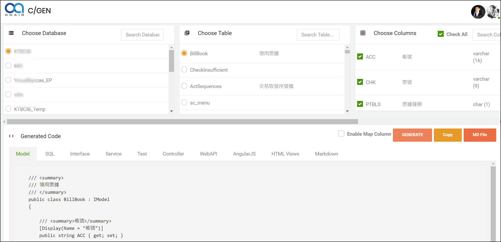

# MyCodeGen - 程式碼產生工具
Init source code is copy from ：https://github.com/ShashangkaShekhar/Code-Generator

(TW)我額外增加需求，並修正其程式碼架構。

(TW)歡迎志同道合者加入需求開發

## 現階段額外增加的網站功能：

(上至下，由舊到新)

* :ballot_box_with_check: (TW)Table欄位資訊額外取得-Description資料  (2018/11/09 add)
* :ballot_box_with_check: (TW)Model產生樣式的架構，改寫使用DotLiquid的樣版處理  (2018/11/09 add)
* :ballot_box_with_check: (TW)取得Table的描述資訊，並傳至CodeGenerate中使用(2018/11/12)
* :ballot_box_with_check: (TW)Generate 後的Response Data改為Dictionary的Json資料以便於判斷及維護(2018/11/12)
* :ballot_box_with_check: (TW)各類型的資料Generate，皆一致傳入dbTable及dbColumns的資訊(2018/11/12)

## TODO Requirement：(待設計的需求)

## Getting Started

(TODO)

### Prerequisites

(TODO)

### Installing

see this page： [建置手冊.md](https://github.com/hougii/MyCodeGen/blob/master/%E5%BB%BA%E7%BD%AE%E6%89%8B%E5%86%8A.md)

## Running the tests

(None)

## Deployment

(TODO)

## Built With

## Liquid Variable

when you define template, the default variable is contain : [table , columns , other ]

each model's property  information:

| Type     | Table Info                                                   | Column Info                                                  | Other Info                                                   |
| -------- | ------------------------------------------------------------ | ------------------------------------------------------------ | ------------------------------------------------------------ |
| variable | TableId TableName MapTableName TableDescription | ColumnId, ColumnName, MapColumnName, ColumnDescription, DataType, ModelType, MaxLength, | IndentityColumn IndentityModelType IndentityColumnDescription |
| Sample   | {{table.MapTableName}}                                       | {{column.ColumnName}}                                        | {{other.IndentityColumn}}                                    |
| memo     | can see "TableInfoForLiquid.cs" under the "LiquidModels" folder | can see "ColumnInfoForLiquid.cs" under the "LiquidModels" folder | can see "OtherForLiquid.cs" under the "LiquidModels" folder |

## Contributing

## Versioning

(TODO)

## Authors

- **ShashangkaShekhar ** - *original code author* - [ShashangkaShekhar](https://github.com/ShashangkaShekhar)
- **Howard Chiang** - *it's me , add some useful requirement !* - [Howard Chiang](https://github.com/hougii)

## License

This project is licensed under the MIT License - see the [LICENSE.md](LICENSE.md) file for details

## Acknowledgments

- thanks  ShashangkaShekhar ,code init Auther,  i use your source code and append my requirement.
