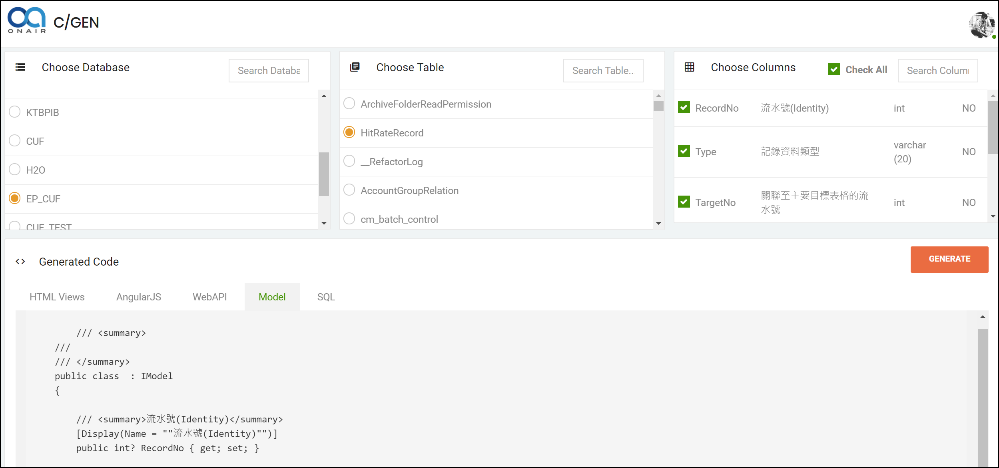

# MyCodeGen - 程式碼產生工具
Init source code is copy from ：https://github.com/ShashangkaShekhar/Code-Generator

(TW)我額外增加需求，並修正其程式碼架構。

(TW)歡迎志同道合者加入需求開發

## 現階段修正的網站功能：

* 
* (TW)Table欄位資訊額外取得-Description資料  (2018/11/09 add)
* (TW)Model產生樣式的架構，改寫使用DotLiquid的樣版處理  (2018/11/09 add)
* 

## TODO Requirement：(待設計的需求)

## Getting Started

(TODO)

### Prerequisites

(TODO)

### Installing

see this page： [建置手冊.md](https://github.com/hougii/MyCodeGen/blob/master/%E5%BB%BA%E7%BD%AE%E6%89%8B%E5%86%8A.md)

## Running the tests

(None)

## Deployment

(TODO)

## Built With

## Contributing

## Versioning

(TODO)

## Authors

- **ShashangkaShekhar ** - *original code author* - [ShashangkaShekhar](https://github.com/ShashangkaShekhar)
- **Howard Chiang** - *it's me , add some useful requirement !* - [Howard Chiang](https://github.com/hougii)

## License

This project is licensed under the MIT License - see the [LICENSE.md](LICENSE.md) file for details

## Acknowledgments

- thanks  ShashangkaShekhar ,code init Auther,  i use your source code to append my requirement.
