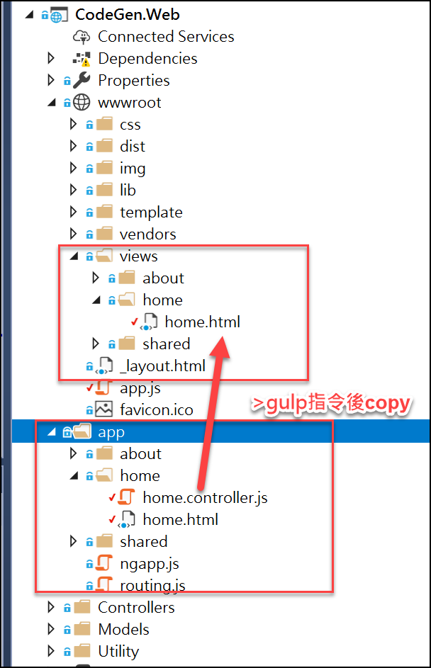
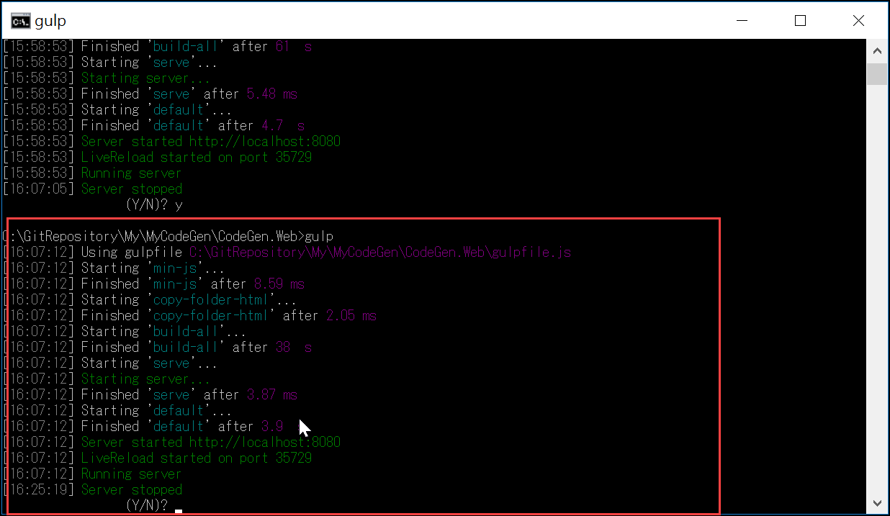
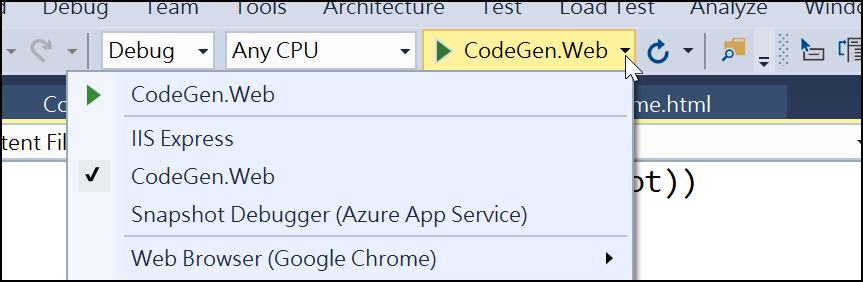
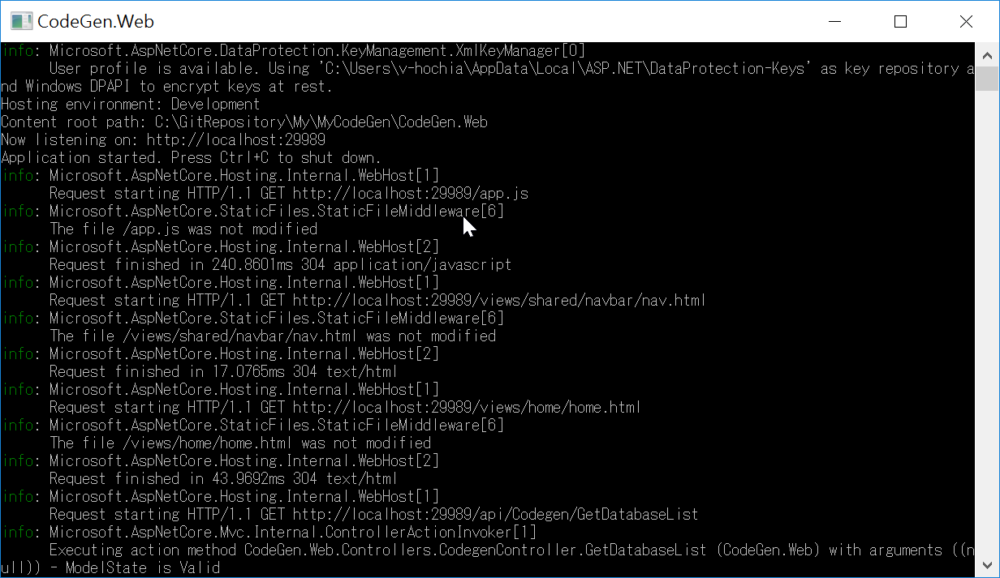
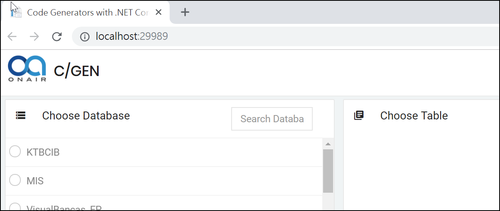
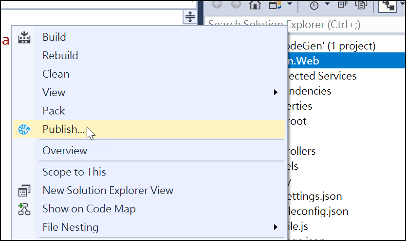
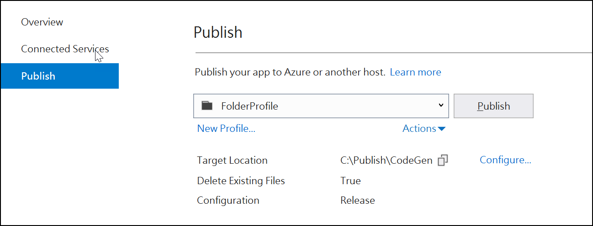
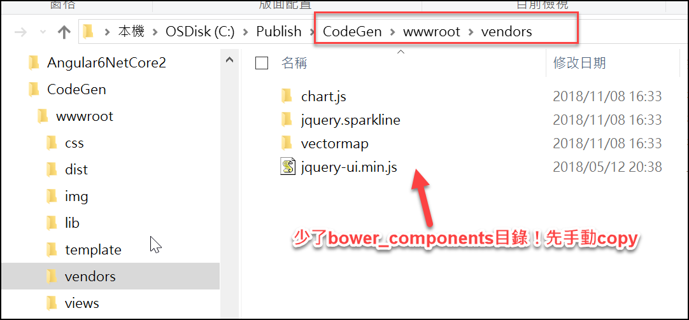

# 建置手冊

自已在建立時的過程與錯誤處理

# 目錄

[TOC]


## 建立於IIS 網站

專案Solution 下的Publish 後，將Publish後的檔案放至網站下即可。


註1：bower_components 的檔案，需手動copy 至publish目錄下的\wwwroot\vendors\下

註2：ApplicationPool，有沒有設定「.NET CLR版本」都沒有差；(而.NET Core本就不會用.NET CLR版本)


網站瀏覽的結果


## VS2017開發編譯

因它是.NET Core的開發框架，所以編譯動作有"怪怪"的地方。

1. 於Project層級開啟cmd，並執行指令：

   ```shell
   #安裝npm資料
   npm install
   #它是透過gulp(吞)的機制編譯,>gulp //它預設是執行gulpfile.js下的'default' task
   gulp
   ```

   註：執行gulp指令後，才會copy Html至 wwwroot下 (VS 執行F5後，它是依wwwroot的資訊的)

   

執行gulp後，它是運作起來，但網站不知如何查看(8080 port不行)

欲結束則輸入「Ctrl +x ,Ctrl +c」結束。		


2. 直接於VS2017下，執行Run：



執行後，網站為 29989 port。





(網站建置完成)


## 佈署網站

點選publish



單純先Publish至本機目錄



log下它Publish所執行的指令

```shell
"dotnet" exec --runtimeconfig "C:\GitRepository\My\MyCodeGen\CodeGen.Web\bin\Release\netcoreapp2.0\CodeGen.Web.runtimeconfig.json" --depsfile "C:\GitRepository\My\MyCodeGen\CodeGen.Web\bin\Release\netcoreapp2.0\CodeGen.Web.deps.json" "C:\Users\v-hochia\.nuget\packages\microsoft.aspnetcore.mvc.razor.viewcompilation\2.0.3\build\netstandard2.0\Microsoft.AspNetCore.Mvc.Razor.ViewCompilation.dll" @"obj\Release\netcoreapp2.0\microsoft.aspnetcore.mvc.razor.viewcompilation.rsp"
```


發行後的問題，




## 所遇問題Issue


### Publish後沒有copy bower_components下的檔案至目標位置

#### 問題原因：

因網站需要這些檔案


但Publish後的wwwroot\vendors\下並沒有產生相關檔案

所以會導至頁面無法呈現。

#### 解法：

目前先手動Copy bower_components至目標位置。

