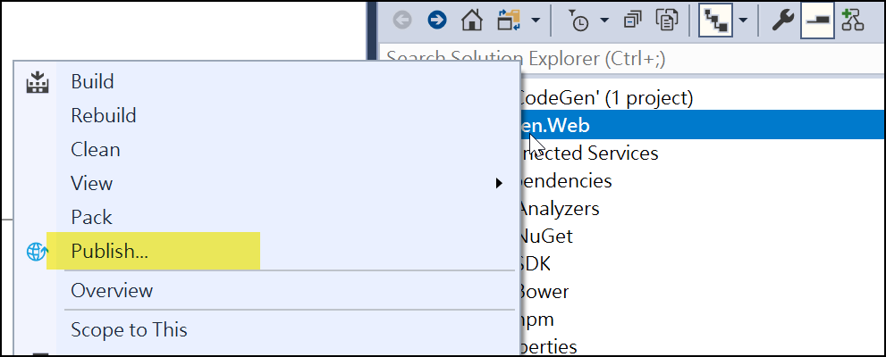
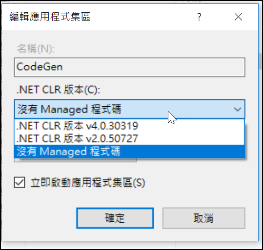
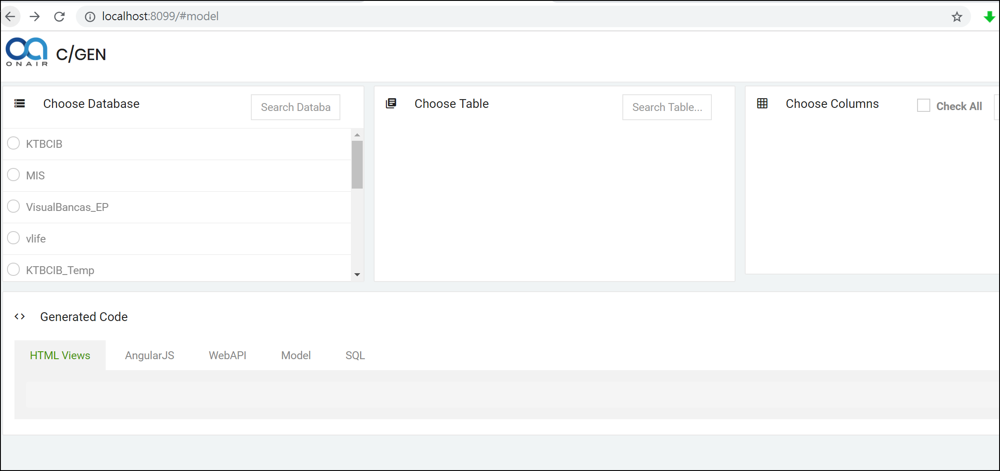
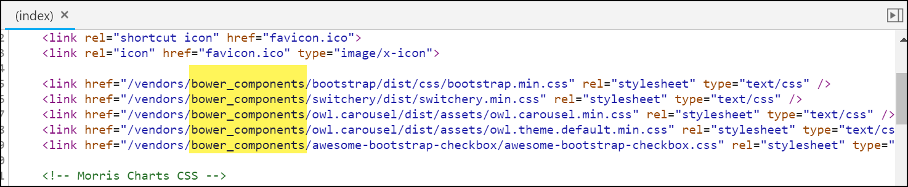

# 建置手冊

自已在建立時的過程與錯誤處理

# 目錄

[TOC]

## 建立於IIS 網站

專案Solution 下的Publish 後，將Publish後的檔案放至網站下即可。

註1：bower_components 的檔案，需手動copy 至publish目錄下的\wwwroot\vendors\下

註2：ApplicationPool，有沒有設定「.NET CLR版本」都沒有差；(而.NET Core本就不會用.NET CLR版本)

網站瀏覽的結果

## 所遇問題Issue

### Publish後沒有copy bower_components下的檔案至目標位置

#### 問題原因：

因網站需要這些檔案

但Publish後的wwwroot\vendors\下並沒有產生相關檔案

所以會導至頁面無法呈現。

#### 解法：

目前先手動Copy至目標位置。

