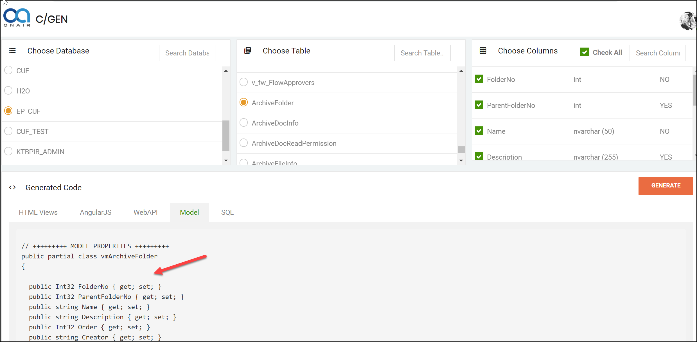

# 需求改版

將Code Gen的改版項目Log於此

# 目錄

[TOC]

# 需求項目

### 待處理需求：

(上至下，由舊到新)

:ballot_box_with_check:  (if complete)​  :black_square_button: (not complete)

* :black_square_button: (TW)將各類型的Generated Code改為套用Liquid的樣版框架 (2018/11/12 add)
* :ballot_box_with_check:(TW)取得Table的描述資訊，並傳至CodeGenerate中使用(2018/11/12)

## Model加上 DB 的描述資訊(2018/11/07 add)

現狀是沒有這功能的，看怎麼樣補上此項目，讓它可以產生對應Model註解說明

### 開發結果圖

1. 取得其Description的欄位資料。

   (遇到其編譯建置的怪現象，讓我debug好久找不出為何它沒有產生)

